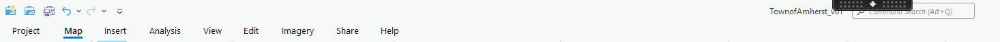

# Lab #1 – Introduction to GIS & Geospatial Data
### GEOL/ENST 253: Geospatial Inquiry & GIS
### Prof. Michelle Fame
---

## Introduction

### Overview
In this lab, we will begin to practice with some of the basic components of ArcGIS Pro. We will be working with a variety of geospatial data types to make a simple map of the Town of Amherst and do some very basic geospatial analyses. The data and maps you generate in this lab may be used again in future labs, so be sure to organize, name, and save everything properly. 

### Learning Goals
* Using the Virtual Computing Lab (VCL) to access ArcGIS Pro 
* Using the F: Drive for file management
* Getting familiar with the ArcGIS Pro interface and basic tools 
* Managing geospatial data with ArcCatalog 
* Adding fields, using the field calculator, and symbolizing vector data
* Introduction to working with rasters and ArcToolbox 

---

## Part 1: Set Up Azure

File management is an essential part of using GIS and is essential to your success in this class. Taking a little extra time to get your file system organized before you dive into a project will save you many headaches down the line. Today, I want to model that behavior. 

Before any of us start on the assignment, let’s make sure everyone is successfully connected to the VCL, the F: drive, and can open ArcGIS Pro. Take notes on what we did to get connected; me, Andy, and your TA will come around and troubleshoot any issues you run into. If things go slowly today, make use of this time to catch up with classmates you already know and get to know folks you have not met before.

**Installation & Connection:**
1. Download and install the **Windows App** from the App Store (Mac) or Microsoft Store (PC) onto your computer in order to access Azure (the program which hosts our remote desktop system). 
2. Open the app, click **"+"**, and select **Add work or school account**.
3. Use your full email address (`@amherst.edu`) and login as normal.
4. Once the ArcGIS 3.5 Desktop is available, click on the **"..."** icon and select **Connect**.

**File Management Overview:**
Open a folder and navigate to the class drive. Here is how the drive is structured:
* **Admin:** A folder only Michelle can access.
* **SharedFiles:** Where I will distribute map documents and files for most labs (although this week I did it for you).
* **StudentFolders:** You will find a folder with your username on it that only you and Michelle can access; this will be the folder where you will save all of your work for this class.

**Your Workspace For Today:**
Navigate to `StudentFolders` > `AStudent26` (find your own student ID, this is my stand-in for your personal folder from here on out) > `Labs` > `Lab_1` > `TownofAmherst_v01`

---

## Part 2: ArcGIS Pro Map Interface

Double-click on the folder `TownofAmherst_v01` and open up the ArcGIS Project File named `TownofAmherst_v01.aprx`.

**Logging In:**
1. When ArcGIS is opening up, you will need to login using **Your ArcGIS Organization’s URL**.
2. Enter `amherstcollege.map.arcgis.com` and click **Continue**.
3. Login to Amherst College as normal (using Duo Mobile).

Once your map is open, take some time familiarizing yourself with the display. Click through the tabs at the top to gain some familiarity with what each contains. When you are done playing, click back on the **Map** tab.

> **❓ Question 1:** What do each of these tools in the ribbon menu at the top of the page do? Label them below and then play around with them so that you feel confident with how they work.

> **💡 Pro Tip:** A useful shortcut is that if you click `Shift` while having the explore tool selected, you can draw a box on the map to zoom to that extent. 

**Exploring Map Properties:**
1. Check and uncheck layers in the **Contents** window and move layers around into different drawing orders. 
2. Right-click on **Map** in the Contents window and look at the map document's properties. 

> **❓ Question 2:** What are the display units for the map? Find where these display on the map as you move your cursor around. What Coordinate System is the map currently in?

*(Do not change anything in map document properties and click cancel).*

**Exploring Layer Properties:**
1. Right-click on **USA_States** and look at the layer properties. 
2. Click **Source** and look in the **Database** row to see the pathname where the source data for the layer is saved. 

> **❓ Question 3:** Fill in the rest of the full pathname for `USA_States`. It should be in a geodatabase within your folder for this class that begins as shown below. If it is not, please ask for help.  
`F:\MichelleFame\GEOL_ENST_253_F2025\StudentFolders\...`

**Selecting and Exporting Features:**
1. Right-click on **USA_States** and open up the attribute table. 
2. At the top of the table (or in the "Map" ribbon menu), find the **Select by Attributes** button. 
3. Input search criteria such that only the state of Massachusetts is highlighted. 
4. Click the blue button at the bottom of the attribute table to only view records that are highlighted.
5. Click **Zoom to** (the little magnifying glass) to zoom to your selected features.
6. With Massachusetts still selected, right-click on **USA_States** > **Data** > **Export Features**. 
7. Save the output feature class in `TownofAmherst_v01.gdb` and in the `Mass` feature dataset (click the yellow folder button and navigate to the geodatabase). Name the output feature class `Mass_State`. This will create a new feature class that is just the state of Massachusetts and add it to your map.

Repeat these steps again with `USA_Counties` and export a feature class with only Massachusetts Counties. Name it `Mass_Counties`.

Turn off (uncheck) or remove (right-click > remove layer) all other state and counties layers. 

> **❓ Question 4:** The `Mass_State` borders do not appear to line up with the state borders in the streaming base maps or the `Mass_Counties` layers, especially on the coast and islands. Why do you think this might be?

*(Close all attribute tables and save your work periodically).*

---

## Part 3: ArcCatalog Pane

Open the Arc Catalog Pane (**View** > **Catalog Pane**), and expand **Folders** and **Databases**. 

* **Databases:** Shows you the default geodatabase the map is operating from, in this case `TownofAmherst_v01.gdb`. 
* **Folders:** Shows all subfolders within the project. Expand it to see the variety of folders and files that are saved within the project including the geodatabase we are working out of. 

In "Folders" or "Databases", expand `TownofAmherst_v01.gdb` and take a look.

> **❓ Question 5:** > * Define “geodatabase”, “feature dataset”, “feature class”, and “(map) layer”, emphasizing their relationships and differences. 
> * What feature datasets are contained within `TownofAmherst_01.gdb`?
> * What feature classes are contained within the `USA` feature dataset, and which of those layers are currently on your map? 
> * What feature classes are contained within the `AmherstTown` feature dataset, and which of those layers are currently on your map?

Right-click on `TownofAmherst_01.gdb` and create a new feature dataset called `AmherstCollege`. 

*(Save your work periodically).*

---

## Part 4: Field Data and Basic Symbology

> **❓ Question 6:** Review the differences between vector and raster data. Write a working definition of each in your own words which includes a sketch.

**Working with Vector Data:**
1. Open the `Mass` feature dataset and add the `Mass_Towns` feature class to the map by dragging them into the table of contents or right-clicking and selecting **Add to current map**. 
2. Export a feature class to the `AmherstTown` feature dataset that contains just the outline of the Town of Amherst and name it `Amherst_TownBoundary`. Close all attribute tables.
3. Right-click on your new layer `Amherst_TownBoundary` and click **Zoom to layer**. Turn off or remove `Mass_State`, `Mass_Counties`, and `Mass Towns` layers from the map.
4. In the catalog window, open the `AmherstTown` feature dataset and add `Amherst_Parcels`, `Amherst_StreetCenterlines`, and `Amherst_StreetTrees` feature classes to the map.

Check out these newly added map layers by turning them on and off, zooming in and out, looking at their attribute tables, and identifying features by clicking on them. These are examples of the three possible types of vector datasets: points, lines, and polygons. 

Right-click on each layer and open up the **Symbology** viewer. Play around with changing the symbology of the point, lines, and polygon features. 

The `Amherst_StreetTrees` layer is a bit overwhelming at this scale, so turn that layer off. 

**Calculating Geometry:**
Open up the attribute table for your newly created `Amherst_TownBoundary` layer. Check out the column that says `Shape Area`. This field automatically calculates the area of each polygon feature. However, I’m not sure what the units are, and the projection this map is in right now is very bad at calculating area correctly. Let's fix this by adding a new field and recalculating the geometry using known units and a different projection. 

1. At the top of the attribute table, find and click the **Add** button to add a field. 
2. Name the new field `AREA_SQKM`. Change the data type to **Float** so we can have decimals. 
3. When you are happy, click **Save** on the "Field" ribbon at the top of the map.
4. Close the field editor and go back to the attribute table. The new field is currently empty.
5. Right-click on the top of the new field and choose **Calculate Geometry**. 
6. Change the units to **Square Kilometers**, and change the coordinate system to **NAD 1983 StatePlane Massachusetts FIPS 2001 (Meters)** by clicking on the mini globe symbol. (We will talk more later about how coordinate systems can impact area calculations). 

> **❓ Question 7:** Based on your calculation in ArcGIS, what is the total area of the Town of Amherst in square kilometers rounded to 2 decimal places?

**Applying to Parcels:**
1. Open up the attribute table for `Amherst_Parcels`.
2. Use **Select by Attributes** to select and then export a new feature class to the `AmherstCollege` dataset that only contains land parcels owned by "Amherst College Trustees" or "Trustees of Amherst College". Name it `AmherstCollege_Parcels`.
3. Add a new Float field to `AmherstCollege_Parcels` called `AREA_SQKM`.
4. Calculate the area of each parcel in square kilometers using the NAD 1983 StatePlane Massachusetts FIPS 2001 (Meters) Coordinate System.
5. To get the total area, right-click at the top of your new area field and choose **Explore Statistics** to find the sum.

> **❓ Question 8:** > (A) Based on your calculation in ArcGIS, how many square kilometers of land are owned by the Amherst College Trustees rounded to 2 decimal places? 
> (B) What percentage of the total land area in the Town of Amherst is owned by the Amherst College Trustees?

*(Save your work periodically).*

---

## Part 5: Rasters and ArcToolbox

Look back at the geodatabase we have been working out of in the Catalog Pane. Identify the one raster file and add it to the map. This is a common type of raster called a Digital Elevation Model (DEM), meaning each pixel contains elevation information (in this case, meters above sea level).

With the explore tool selected, click on the DEM in various locations to identify the elevation value in meters at the location you clicked.  

**Using ArcToolbox:**
ArcToolbox is a set of predesigned codes that you can run geospatial data through in order to change or analyze the data in specific and useful ways. 

1. Open ArcToolbox (**Analysis** > **Tools**) and search for **Extract by Mask**. Click to open the tool. 

> **❓ Question 9:** Read the description of the Extract by Mask Tool and click on the question mark. What do you think this tool does?

2. Fill out the form in the tool window and click run. Make sure to save output files in the working geodatabase and name the output file `Amherst_DEM_1ArcSec`. *(1 arc second is the raster resolution).*
3. Turn off the original raster and reorder the layers so you can see the output. Did you guess correctly as to what the tool does? 
4. Right-click on `Amherst_DEM_1ArcSec` in the Table of Contents and open up **Symbology**.
5. Under color scheme check **Show all names** and then choose **Elevation #1**. 

> **❓ Question 10:** Based on the DEM legend in the table of contents, what is the range of elevation in the town of Amherst? Where are the highest elevation values?

**Final Map Cleanup:**
Rearrange the layers and change the symbology so that your final map shows the Amherst DEM overlain by the Amherst Streets symbolized by a 1-point black line, and the Amherst College Owned land parcels outlined in a 2-point purple line with no fill color. 

Save your work and close this file for now; we will be using it again in future labs.

---

# Reflection

> **❓ Question 11:** What concepts or skills which you practiced or reviewed in this lab would you now feel confident in independently applying to your own geospatial work?

> **❓ Question 12:** What questions or problems are you still having with the skills or concepts practiced in this lab?
